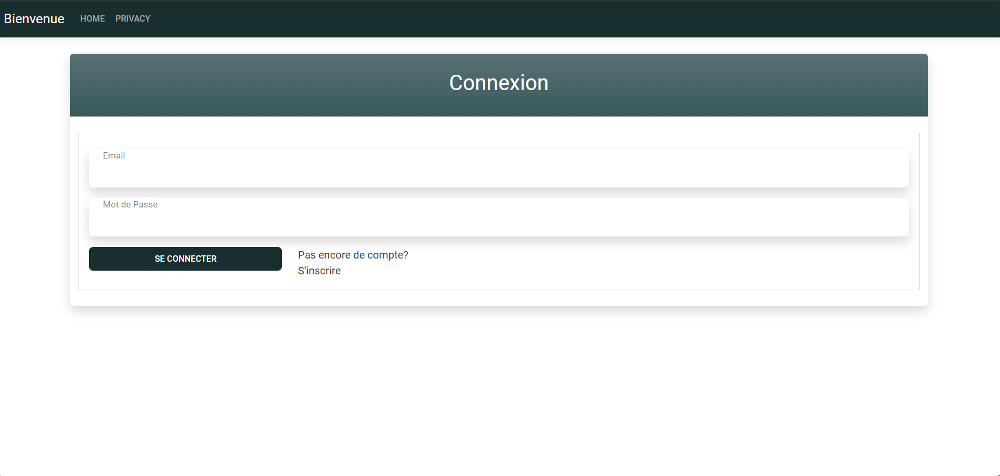

# Page  de Connexion
Un simple page de connexion créé avec HTML, CSS, Bootstrap, et PHP. Ce formulaire permet aux utilisateurs de se connecter. Pour se faire, j'ai utilisé une base de données static.

Aperçu du Projet




##Structure du projet
```sh
📂 votre-repertoire-de-projet
├── lib                # Les Styles Bootstrap
├── footer.php          # Footer du site
├── header.php          # Le navbar de la page
├── index.php           # Page HTML principal
├── login.php         # Script PHP pour traiter le formulaire
├── styles.css          # Fichier de style CSS
└── screenshot.png      # Capture d'écran du formulaire
```


<br/>
Prérequis
Avant de commencer , assurez vous d'avoir ces élément instalés :

Un serveur Web supportant PHP (ex: Apache, Nginx ou XAMPP). <br/>
PHP version 7.0 ou supérieure.

## Installation

1. Cloner le depot:
```sh
git clone https://github.com/Omarseck6/Projet_Page_de_Connexion.git
```
2. Placez le dossier dans votre serveur web (ex: le dossier htdocs pour XAMPP).
3. Lancez le serveur et ouvrez index.html dans votre navigateur.

## Utilisation

Remplissez les champs du formulaire.<br/>
Cliquez sur "Se Connecter" pour soumettre les informations.<br/>
Si tous les champs sont valides, le formulaire sera soumis et vous aurez un message de bienvenue.

"" License
This project is licensed under the MIT License.


